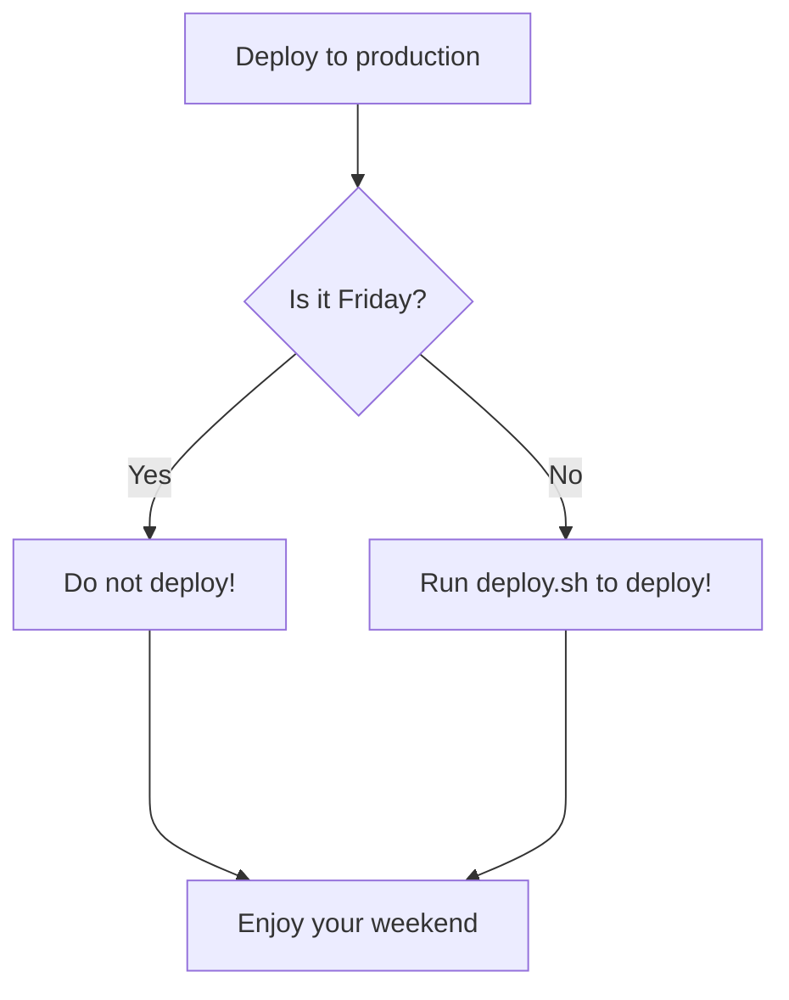
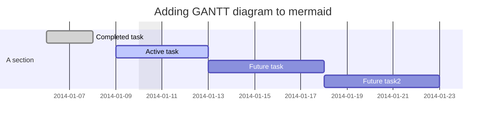

# What is this?

A flowchart [using Mermaid support in Markdown files](https://github.blog/2022-02-14-include-diagrams-markdown-files-mermaid/)

```mermaid
flowchart TD
  A[Deploy to production] --> B{Is it Friday?};
  B -- Yes --> C[Do not deploy!];
  B -- No --> D[Run deploy.sh to deploy!];
  C ----> E[Enjoy your weekend];
  D ----> E[Enjoy your weekend];
```

## Gantt

```mermaid
gantt
dateFormat  YYYY-MM-DD
title Adding GANTT diagram to mermaid
excludes weekdays 2014-01-10

section A section
Completed task            :done,    des1, 2014-01-06,2014-01-08
Active task               :active,  des2, 2014-01-09, 3d
Future task               :         des3, after des2, 5d
Future task2               :         des4, after des3, 5d
```

